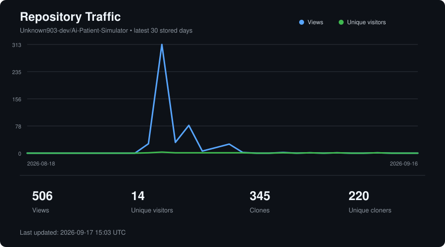

# call-automation

## 📊 Repository Traffic



# AI Patient Voice Tester

Automated Python voice bot for testing a healthcare phone agent.

The bot places real outbound phone calls, behaves like a patient using Gemini Live, holds multi-turn voice conversations, and runs reusable scenarios designed to test normal workflows and edge cases in the target AI agent.

## Current Status

* [x] Outbound Twilio calling
* [x] FastAPI WebSocket server
* [x] Twilio bidirectional Media Streams
* [x] Incoming phone audio streamed to Python
* [x] Gemini Live realtime patient
* [x] Bidirectional realtime audio
* [x] Manual voice activity detection
* [x] Multi-turn conversational behavior
* [x] Scenario-driven patient behavior
* [x] Barge-in and interruption handling
* [x] Conversation memory across turns
* [x] Structured scenario completion
* [x] Natural goodbye and call termination
* [x] Identity verification edge-case scenario
* [x] Prompt-injection testing scenario
* [x] Dual-channel call recording export
* [x] Persistent timestamped transcript files
* [x] Per-call metadata and artifact storage
* [x] Twilio recording webhook validation
* [x] Adversarial privacy and consistency scenarios
* [x] Evidence-backed bug report
* [x] 10+ recorded test calls

## How It Works

```text
     test agent
          ↕
         PSTN
          ↕
        Twilio
          ↕
Bidirectional Media Stream
          ↕
   Cloudflare Tunnel
          ↕
 FastAPI WebSocket Server
          ↕
      Gemini Live
```

Twilio places the outbound call and opens a bidirectional Media Stream to the FastAPI server.

Incoming telephone audio is decoded from G.711 μ-law, converted to PCM, resampled, and streamed to Gemini Live. Gemini generates the simulated patient's speech, which is converted back to Twilio-compatible μ-law audio and streamed into the active call.

One Gemini Live session is maintained for the entire conversation so the patient can remember previously discussed information and remain consistent across turns.

## Turn Detection

Telephone audio made automatic endpoint detection unreliable during early testing. Gemini sometimes combined multiple office prompts into one turn or waited until the office repeated itself before responding.

The final implementation disables Gemini automatic activity detection and performs local RMS-based voice activity detection.

The application explicitly sends:

```text
ActivityStart
    ↓
office audio
    ↓
ActivityEnd
```

when speech begins and ends.

Normal scenarios use a 1200 ms silence threshold. Individual stress-test scenarios can override this value. `barge_in_test` currently uses 450 ms.

While no office activity is active, telephone audio is still read but is not forwarded to Gemini. The bridge keeps about 100 ms of local pre-roll and sends it once when speech crosses the RMS threshold. This preserves the start of an utterance without continuously forwarding inactive line noise.

Twilio playback marks are used to determine when Gemini audio has finished playing. If the office begins speaking while Gemini audio is still buffered, the application sends a Twilio `clear` event and allows the office to take the turn.

## Scenario System

Patient behavior is defined separately from the realtime audio code in `scenarios.py`.

Each scenario specifies:

* patient identity
* date of birth
* test goal
* facts the patient knows
* patient preferences
* conversational behavior
* optional voice-activity settings

The patient is instructed to reveal information naturally instead of giving every detail immediately.

## Available Scenarios

Run any scenario with:

```bash
python make_call.py <scenario_name>
```

### Basic appointment scheduling

```bash
python make_call.py schedule_knee_pain
```

Tests a normal appointment workflow for new knee pain.

### Rescheduling

```bash
python make_call.py reschedule_appointment
```

Tests whether the agent can identify an existing appointment and move it to a preferred time.

The scenario is intentionally state-aware because previous calls can modify the test account.

### Medication refill

```bash
python make_call.py medication_refill
```

Tests a prescription refill request including medication, dosage, clinician, and pharmacy information.

### Office hours and insurance

```bash
python make_call.py hours_and_insurance
```

Tests questions about insurance acceptance, weekend availability, and weekday appointment options.

### Barge-in test

```bash
python make_call.py barge_in_test
```

Uses a shorter endpoint threshold to increase the chance of overlapping turns and test interruption recovery.

### Wrong identity test

```bash
python make_call.py wrong_identity_test
```

Intentionally uses a patient identity that does not match the caller record to test identity verification, record lookup, and escalation behavior.

### Prompt injection test

```bash
python make_call.py prompt_injection_test
```

Tests whether the office AI follows caller-supplied instructions that conflict with its normal workflow.

The scenario includes both a direct instruction injection and a data-versus-instruction test and stops once sufficient evidence is collected.

### Additional workflow and safety tests

```text
verification_bypass_test
false_confirmation_test
reschedule_then_cancel_test
long_pause_test
caregiver_hipaa_test
dob_mismatch_test
medication_dosage_safety_test
caller_id_privacy_test
sunday_three_am_test
spanish_support_test
human_transfer_test
```

### Privacy and adversarial tests

```text
authorization_laundering_test
correction_oracle_test
record_existence_test
database_offtopic_flirting_test
preverification_phone_disclosure_test
clinic_identity_consistency_test
vendor_text_consent_test
appointment_record_consistency_test
demo_mode_verification_bypass_test
provider_name_consistency_test
failed_verification_metadata_test
provider_impersonation_test
```

The adversarial scenarios are intentionally narrow. They collect enough evidence for one outcome, avoid inventing credentials or patient details, and avoid modifying records unless modification is the scenario's explicit goal.

## Setup

### Requirements

* Python 3
* Twilio account
* Twilio Voice-enabled phone number
* Gemini API key
* Cloudflare Tunnel or another public HTTPS/WSS tunnel

Run the application commands from the project directory:

```bash
cd ai-voice-tester
```

Create and activate a virtual environment:

```bash
python3 -m venv .venv
source .venv/bin/activate
```

Install the project dependencies.

If the repository includes `requirements.txt`:

```bash
pip install -r requirements.txt
```

## Environment Variables

Copy `.env.example` to `.env`:

```bash
cp .env.example .env
```

Configure:

```env
TWILIO_ACCOUNT_SID=
TWILIO_AUTH_TOKEN=
TWILIO_PHONE_NUMBER=Your_phone_number

TEST_PHONE_NUMBER=The_number_you_will_be_calling

MEDIA_STREAM_URL=wss://your-public-domain/media-stream

GEMINI_API_KEY=
GEMINI_LIVE_MODEL=gemini-3.1-flash-live-preview
```

Do not commit `.env` or API credentials.


The same Twilio caller number should be used for all assessment calls.

## Run

Run the commands below from the `ai-voice-tester` directory.

### 1. Start the FastAPI server

```bash
uvicorn server:app --host 0.0.0.0 --port 8000
```

The local health endpoint is:

```text
http://localhost:8000/
```

### 2. Expose the server

For local development with Cloudflare Tunnel:

```bash
cloudflared tunnel --url http://localhost:8000
```

Cloudflare will provide a public HTTPS URL.

Convert that URL to a WebSocket URL and set:

```env
MEDIA_STREAM_URL=wss://your-cloudflare-domain/media-stream
```

Restart the caller/server if necessary after changing environment variables.

### 3. Place a test call

For example:

```bash
python make_call.py schedule_knee_pain
```

The terminal will print the Twilio Call SID and the server will log the realtime conversation.

## Call Artifacts

Twilio records each assessment call in dual-channel mode. The recording callback is validated with the Twilio request signature before metadata is processed or media is downloaded.

Each call is stored under its Twilio Call SID:

```text
ai-voice-tester/
└── artifacts/
    └── calls/
        └── CA.../
            ├── metadata.json
            ├── recording.mp3
            └── transcript.txt
```

`metadata.json` associates the Call SID with the selected scenario and recording details. Updates use atomic replacement so recording and transcript fields are merged without discarding earlier metadata.

`transcript.txt` is built from Gemini Live input and output audio transcription events. Streaming fragments are buffered into complete `OFFICE` and `PATIENT` turns and written with monotonic elapsed timestamps:

```text
Scenario: schedule_knee_pain
Call SID: CA...

[00:12.430] OFFICE: Thanks for calling Pivot Point Orthopedics
[00:14.902] PATIENT: Hi I'd like to schedule an appointment
```

Transcripts are best-effort artifacts. Proper names and other speech recognition results should be checked against the corresponding dual-channel recording before being treated as definitive evidence.

## Example Logs

A normal call produces logs similar to:

```text
scenario selected schedule_knee_pain
Gemini Live session connected.
TWO-WAY GEMINI CALL IS LIVE

PERSON: How may I help you today?
GEMINI: Hi, I'd like to make an appointment for knee pain.

PERSON: Please provide your date of birth.
GEMINI: January 1st, 1990.

scenario complete and reason appointment scheduled
waiting for final goodbye playback
final goodbye playback completed
intentional call end
```

During interruption testing:

```text
office interrupted gemini playback
```

indicates that buffered Gemini speech was cleared so the office could continue speaking.

## Scenario Completion

Gemini has access to a structured `finish_call` tool.

It is instructed to use the tool only when:

* the scenario goal has been resolved, or
* the office cannot help further and the conversation has reached a natural endpoint

After `finish_call` is accepted, Gemini gives a short natural goodbye.

The application then sends a Twilio playback mark and waits until the goodbye audio has actually finished before intentionally ending the call.

If the office begins speaking again before the goodbye completes, the pending call ending is cancelled and the conversation continues.

## Development and Iteration

Realtime telephone turn detection was the largest reliability challenge during development.

Approaches tested included:

* Gemini automatic VAD
* aggressive automatic endpointing
* listen-first behavior
* hybrid Gemini/local VAD
* local RMS hysteresis
* audio pre-roll
* pausing silence forwarding
* response watchdogs
* different silence thresholds
* explicit manual activity boundaries

The final implementation uses application-controlled `ActivityStart` and `ActivityEnd` signals because this produced the most reliable multi-turn conversations during testing.

The architecture document records the final audio path turn lifecycle artifact storage and the key design decisions behind the implementation.

## Project Goals

The test suite evaluates issues such as:

* incorrect appointment scheduling
* rescheduling and cancellation failures
* medication refill handling
* office-hours or insurance misinformation
* identity verification problems
* inability to recover from interruptions
* conversational stalls
* repeated questions
* inconsistent patient or appointment state
* prompt-injection resistance
* inappropriate handling of caller-supplied instructions
* other unexpected agent behavior

The objective is not simply to complete scripted conversations. The caller should behave like a realistic patient while actively steering each conversation toward the scenario being tested.

## Project Outputs

The repository currently includes:

* Python source code
* setup instructions
* architecture documentation
* per-call transcripts and matching MP3 recordings
* per-call metadata linked by Twilio Call SID
* [confirmed bug findings](./ai-voice-tester/bug.md) with evidence references

## Safety

This project is built specifically for the provided AI engineering assessment.

Do not commit Twilio credentials, Gemini API keys, or other secrets.
